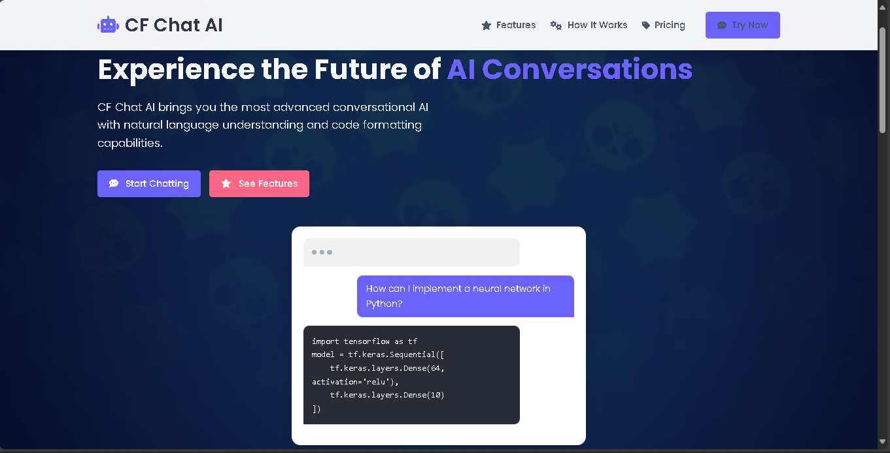
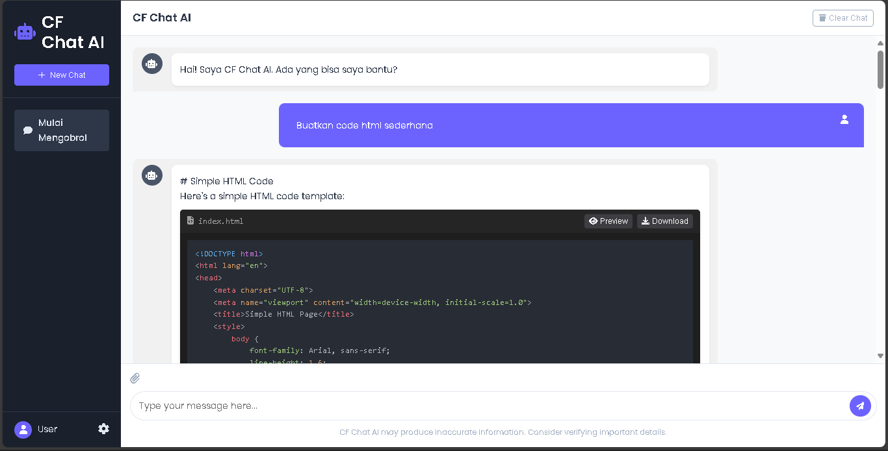

# **📌 CF Chat AI - Keren Banget!**  
**Website Chat AI Modern dengan Fitur Gokil**  


*[🔥 Live Demo](https://ai.wbagazk.my.id/)*  

---

## **💡 Deskripsi**  
CF Chat AI adalah website **chatbot kekinian** buat kalian yang mau nanya apa aja! Dibekali fitur:  
- **Ngobrol pake AI** canggih (Claude Sonnet 3.5)  
- **Format kode otomatis** kayak VS Code (bisa copy & preview!)  
- **Tampilan keren** & responsif di HP/PC  
- **Gratis!** Gak perlu bayar-bayar  

Buat yang suka coding, ngerjain tugas, atau cuma mau ngetes AI, ini tools cocok banget!  

---

## **🚀 Fitur Unggulan**  
✔️ **Chat AI Cepat** - Jawaban instan kayak punya temen pinter  
✔️ **Support Kode** - Auto format buat HTML/CSS/JS (ada tombol *copy* & *download*)  
✔️ **UI Kekinian** - Animasi smooth & enak dipandang  

---

## **🛠️ Cara Pasang**  

### **📥 Install**  
1. **Clone repo ini**  
   ```bash
   git clone https://github.com/wbagazk/Web-ai-sederhana.git
   ```
2. **Buka folder project**  
   ```bash
   cd Web-ai-sederhana
   ```

### **⚙️ Setup**  
1. **Jalankan website**  
   - Buka file `index.html` pake browser (Chrome/Firefox recommended)  
   - Atau pake **Live Server** kalo pake VS Code  

2. **Kalo mau deploy online**  
   - Upload semua file ke hosting (Netlify/Vercel/GitHub Pages)  
   - Ganti API endpoint di `chat.js` kalo perlu  

---

## **🎨 Customisasi**  
Mau bikin versi lu sendiri? Gampang!  
- **Ganti warna tema**: Edit di `:root` di file `style.css`  
  ```css
  :root {
    --primary-color: #6c63ff;  /* Ganti ini buat warna utama */
    --dark-color: #1a1a1a;     /* Warna dark mode */
  }
  ```
- **Ganti API**: Kalo mau pake AI lain, update endpoint di `chat.js`  
  ```javascript
  const apiUrl = "https://api-sendiri.com/ai";  // Ganti ini
  ```
- *[Saya Menggunakan Api Dari siputzx](https://api.siputzx.my.id/)*


---

## **📱 Tampilan**  
| **Landing Page** | **Chat Interface** |  
|------------------|-------------------|  
| ||

---

## **💬 Kontribusi**  
Boleh banget mau bantu develop! Caranya:  
1. Fork repo ini  
2. Buat branch baru (`fitur-baru`)  
3. Commit perubahan  
4. Push & buat Pull Request  

---

## **📜 License**  
Project ini pake license **MIT**, jadi bebas dipake, dimodif, bahkan dijual (yang penting cantumin credit ya!).  

---

**🔥 Keren kan?** Cobain langsung atau fork buat kembangkan lagi!  
**Kalo ada error, jangan sungkan buka issue 😉**  

[⬆️ Kembali ke Atas](#-cf-chat-ai---keren-banget)
